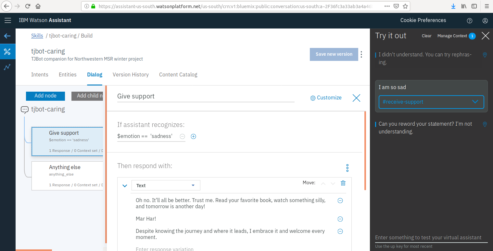

# TJBot: A Caring, Emotionally Intelligent Robot

This is a project to build/program a simple, caring emotionally intelligent robot using IBM’s TJBot and Watson Services. New functionalities will be added to the TJBot to best fit the project goals. The target audience is intended to be all people who want a companion, entertainment, or a support system during difficult times.

## **Weekly Goals**:

* ## **Week 1/21/19**
  * Get the robot fully functional (get the arm waving)
  * Figure out what is needed for IBM Cloud/Watson Services
    * What services do I need?
    * What do the services do?
    * Why do I think I need the services?
    * How much will services cost?
    * What are the restrictions
    * Create the Watson services
  
  * ### **Meeting Agenda**:
    * #### What was accomplished? 
      * Got Rpi headless, configured wifi and remote desktop access
      * Researched the services I need
      * Ran arm wave IBM jbot recipe demo with success.  Ran other tjbot recipe tests for speaker check, camera check, LED check, servo check.

      * TODO: 
        * Week 1/28 goals, create git clone of project on the Raspberry Pi

    * #### What problems were encountered? 
      * None major, slight issues with configuring wifi

    * #### What are the challenges for the coming week?  
      * Updating the config file to use API key and URL vs username and pw,  learning NODE.js 

  * ### **Meeting Minutes**:
    * **Comments from Matthew**:
      * Git workflow suggestions
      * Suggestions on implementing the tone test. Simple action/respone test where LED can shine based on tone, as an example. 
    * **Comments from Team**:
      *  N/A

* ## **Week 1/28/19**
  * Work on Step 2 from the proposal (focus on tone detection)
    * User initiates negative tone 
    * Program robot to respond 
    * Plan out how to go beyond existing demos (ideas are in the proposal)
    * Execute tests

  * ### **Meeting Agenda**:
    * #### What was accomplished? 
      * Configured cloud connectivity 
      * Configured git clone on Raspberry Pi 
      * Updated configuration files ready for testing speech to text, tone analysis, text to speech, and Watson Assistant conversation. 
      * Tested another recipe that tests user asking TJBot to shine a disco light with success 
      * Tested Conversation but need to reconfigure speaker
      * Modified a script from a sentiment analysis recipe that allows TJBot to shine his light based on various moods (analyzed via speech to text). 
      The moods tested were sadness, joy, anger, and fear. 
        * See the videos below to see this tests in action! 
          
        
         
        
        
        
        
        
      * Researched github licensing to prepare for git push 
        
 
      * TODO: 
        * Week 2/4 goals
        * Refine test 2 for tone (think of ways for TJ to converse and respond)
        * Push to git ensuring the proper citations and license information is included
    

    * #### What problems were encountered? 
      * General research, finding examples 
      * Debugging 
        * Figuring out how to modify Javascript code. 
        * Speaker connected to 3.5 mm jack doesnt work well. It was suggested online to use bluetooth or usb to 3.5mm adaptor. 

    * #### What are the challenges for the coming week?  
      * Learning  more NODE.js /Javascript for adding more code functionality
      * Updating speaker configuration

  * ### **Meeting Minutes**:
    * **Comments from Matthew**:
      * Importance of continually pushing to Git.
    * **Comments from Team**:
      *  Does the tone analyze speech directly? As it only analyzes tone in the text, I thought this question gave me good insight on improvments for the future. 

* ## **Week 2/4/19**
  * Continue Step 2
  * Test, debug, refine

  * ### **Meeting Agenda**:
    * #### What was accomplished? 
      * Configured speaker via usb adaptor and successfully tested conversation with TJ
      * TODO: Step 2 from proposal (Negative tone test). Program in some of my personal favorite things (such as favorite songs, jokes, quotes,movie quotes), and incorporate that the Watson services (Speech to Text, Tone Analyzer, Text to Speech, Watson Assistant). 

* ## **Week 2/11/19**
  * Finish up Step 2 (**see above TODO for week 2/4/19, may need to adjust the dates**)
    * #### Accomplishments-2/18/19
      * Read through Watson Assistant Tutorial: [Creating Dialogue with Watson](https://console.bluemix.net/docs/services/conversation/dialog-overview.html#dialog-overview). Key components to create dialogue is outlined below:
        *  **Create skill**: a container for all of the artifacts that define a conversation flow.
        *  **Create intent**: define's user's goal or purpose, TJ detects this intent identified by a hashtag based on user-defined phrases (User examples in Watson Assistant)
        *  **Add entities**: Watson’s way of handling significant parts of input used to alter way it responds to intent
        *  **Create dialogue**: uses intents and entities plus context from app to interact with user and provide a response
            -  Add nodes in Watson Assistant
                +  Nodes contain triggers and responses
                    *  Triggers are conditions and if the user input matches a certain condition, the response from TJ is executed 
                    *  Trigger can be a context variable.  This is used if the context variable expression that you specify is true. Use the syntax, $variable_name:value or $variable_name == 'value'. This data exists in the .js code and passed to Assistant service. 
        * Can test dialogue in Watson Assistant's Try it Out panel
      
      * ### Outline of dialogue I plan to code this week:
        * #### **Intent**: #receive-support
          * #### **User examples**: "I feel so horrible, I am so sad, I had an awful day" 
          * #### **Example dialogue 1**: (simplest conversation to test first)
            *  **Parent Node 1**: 
              * If $emotion == 'sadness': // trigger is context variable from tj.analyzeTone(text) method in tjbot libary
                * Then: TJ can give any of these responses at random:
                  * "Oh no. It’ll all be better. Trust me. Read your favorite book, watch something silly, and tomorrow is another day!"
                  *  Mar Har! (silly phrase from Amanda Show)
                  * Despite knowing the journey and where it leads, I embrace it and welcome every moment. (Arrival movie quote)
          
          * #### **Example dialogue 2**: (more complex, but more ideal)
         
            * **Parent Node 1**: 
              * If $emotion == 'sadness': // trigger is context variable
                * Then: TJ asks, "why are you sad?" // response
                  * **Child Node 1**: 
                    * If @situation:break-up: // if reason is break-up 
                      *  Then: Tj responds: "I am so sorry, things will be better, I promise you!"
                  * **Child Node 2**: 
                    * If @situation:job-loss: // if reason is a job-loss
                      *  Then: Tj responds: "Oh no! I'm so sorry. I know you are a smart and capable of anything. It'll all work out in the end!"

      * Read through key node.js functions I'll be using 
      
      * **TODO**-2/18/19:
        * Test out dialogue outlined above
        * Integrate dialogue to added code incorporated all Watson services
        * Test code with Watson Assistant 
      
      * **2/19/19**
        * Created very basic first dialogue flow as shown below (Testing IN WORK):
        
        * Began to add in the node.js code to interface with Watson services (IN WORK)
                        
  * Begin Step 3 from proposal 
    * User initiates positive tone
    * Program robot to respond

* ## **Week 2/18/19**
  * Contine Step 3
  * Test, debug, refine
  
  * ### **Meeting Agenda**:
    * #### What was accomplished? 
      * Code updates toincorporate dialogue with Watson services
      * Incorporated API methods from node-sdk, a Node.js client library to use the Watson APIs.

      * TODO: 
        * Debugging

    * #### What problems were encountered? 
      * Errors of not recognizing "intent.intent", errors not recognizing "text" input passed from Tone Analyzer to tone assistant. 

    * #### What are the challenges for the coming week?  
      * Figuring out what the cause of above issues are

  * ### **Meeting Minutes**:
    * **Comments from Matthew**:
      * 
    * **Comments from Team**:
      * 

* ## **Week 2/25/19**
  * Begin Step 4 from proposal
  * Robot detects quiet environment
  * Program robot to initiate dialogue
  * This is one of the big sretch goals, so if there are issues, or it is too timily to implement, go back and optimize existing functionalities (for instance, explore the facial recognition and Twitter API capabilities) 
  
  * * ### **Meeting Agenda**:
    * #### What was accomplished? 
      * Solved errors with connexting client app with Watson Assistant service
      * Successfully tested dialogue, see image snapshot and video below:
        

        

      * TODO: 
        * Improve dialogue flow. Right now the user expresses tone, and the robot responds, but doesn't expect an additional response from user. I will be sure to update this so that the user can say same more on the same topic and the robot will give additional responses based on that.  I'll also probably incorporate entities, so the robot can respond to specific instances or events the user is experiencing. I'll also want to add other features to enhance conversation (facial recognition, Twitter API, LED and arm wave)

    * #### What problems were encountered? 
      * Time to debug, but nothing really major
    * #### What are the challenges for the coming week?  
      * Time to incorporate best features

  * ### **Meeting Minutes**:
    * **Comments from Matthew**:
      *  something like an arm wave to indicate that youve been heard, test of what to say, help me understand what its not understanding, the interaction is key, if i say something what wil it do while waiting, if unsure, what it does?, how to create continuing dialogue. map out user experiences. David im feeling sad. Be complete interaction. Do you feel better? feedback from you so that it's helped. 
    * **Comments from Team**
      * Continuity. Why are you sad. 

* ## **Week 3/4/19**
  * Continue Step 4
  * Test, debug, refine
  * If not implementing Step 4, continue optimizing other functionalities
  
  * * ### **Meeting Agenda**:
    * #### What was accomplished? 
      * Added arm wave and LED light turn on as cues robot hears user's mood. See video for this test:
        
        

      * Code updates to create continuing dialogue (IN WORK). See Watson Assistant images below and test (NOTE robot asks question but goes back to beginning of conversation in cycle. Code updates to fix this are in work.)

        

        

        

      * TODO: 
        * Continue code updates for continuing dialogue, test, add visual recognition and tweet detection to enhance interaction

    * #### What problems were encountered? 
      * Went past the limit for Speech to Text Service, problems with card authorization for upgrades (okay now, contacted IBM)
    
    * #### What are the challenges for the coming week?  
      * Time to incorporate best features

  * ### **Meeting Minutes**:
    * **Comments from Matthew**:
      *  
    * **Comments from Team**
      *  

* ## **Week 3/11/19**
  * Execute working tests
  * Begin final report and video
  * Work on finalizing Github repo
  
  * ### **Meeting Agenda**:
    * #### What was accomplished? 
      * Updated dialogue to show continuing dialogue with sadness tone. See dialogue snapshots and videos below. 
      
      * **Dialogue process summary**: 
        * User expresses a sad phrase, TJBot detect that it is said via context variable passed from the client application, $emotion=='sad', he asks the user if he would like to talk more about it, and the user can choose yes or no, via intents #yesadvice or #noadvice". If TJBot detects #yesadvice, he asks the user what is going on. Then the user states he is in a breakup via intent #breakup or job loss #jobloss, and TJBot responds accordingly. 
      
        Finally, after receiving TJBots advice, the node Show Appreciation shows user's appreciation via intent #appreciation. More will be added to this flow along with other tones, per meeting discussions. For intance, TJBot gets feedback from user about whether response helped, or if emotion level is not so high, perform different actions, and branch to different tones during conversation of first detected tone. 

        *Intents*
         

         *Intent User Examples (for training)*
         

         *Context Variable from tone detection*
         

         *Dialogue Flow-TJ to respond to Sadness*
         
        
         *Dialogue Flow-TJ gives advice*
         
          
         *User shows appreciation for TJ advice*
         
         

      

      

      

      * TODO: 
        * Enhance dialogue, incorporate other tones, final report
      

* ## *Week 3/18/19**
  * Clean up any of the remaining final tasks (report/video/repo)
  * Prepare for demo

## License/Notes
 * This project is licensed under the Apache License, Version 2.0. Full license text is available here: [LICENSE](./LICENSE.txt). This project includes code modifications from IBM's TJBot recipe code [sentiment_analysis](https://github.com/ibmtjbot/tjbot/blob/master/recipes/sentiment_analysis/sentiment.js). The [NOTICE](./NOTICE.txt) file includes more information about the original work, and the original copyright notice and proper citations are included in the [source code](./tj_human_interact.js). 

