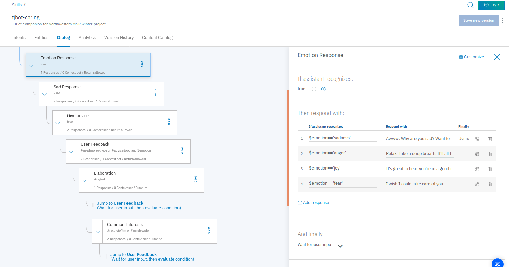

# TJBot: A Caring, Emotionally Intelligent Robot

This is a project to build/program a simple, caring emotionally intelligent robot using IBM’s TJBot and Watson Services. New functionalities will be added to the TJBot to best fit the project goals. The target audience is intended to be all people who want a companion, entertainment, or a support system during difficult times.

### OVERVIEW OF SOFTWARE AND HARDWARE REQUIRED

* **Hardware**: 
  * TJBot Kit
  * Raspberry Pi 3
  * USB Microphone
  * Mini Bluetooth speaker
  * Servo Motor
  * NeoPixel RGB LED (8 mm)
  * F-F plus F-M jumper wires
  * Raspberry Pi Camera
  * Installation instructions shown [here](https://github.com/ibmtjbot/tjbot)
  
* **Software**:  
  * TJBot software
    * Installation instructions shown [here](https://github.com/ibmtjbot/tjbot). 
  * APIs from Watson Developer Cloud: IBM Watson Services as follows: 
  * Speech to Text (enables TJBot to listen to users speak and transcribe it to text)
  * Text to Speech (enables TJBot to speak)
  * Tone Analyzer (enables TJBot to detect emotions in text)
  * Watson Assistant (builds conversational interface with TJBot)
  * Visual Recognition (trains TJBot to recognize facial expressions) 
  * Node.js (to interface with these Watson Services)
  * Twitter API (to allow TJBot to detect emotions in tweets)
  * TJBot library to abstract basic functions for TJBot shown [here](https://github.com/ibmtjbot/tjbotlib). 
  * Node.js library to access IBM Watson Services shown [here]https://github.com/watson-developer-cloud/node-sdk
  * Installation instructions shown [here]https://github.com/watson-developer-cloud/node-sdk
    * assistant.message method used from this library to call the conversation service to send requests with emotional tone input, to allow the conversational agent (in this case TJBot) to interact with the user based on the tone. 

### TJBot and Watson System Overview

Source: Cruz-Parada, Pedro & Zamudio, Victor & Navarro, Javier & Lino, Carlos & Gutierrez Hernandez, David & Baltazar, Rosario. (2018). Identification and Analysis of Emotions in a Game Based Therapy for Patients with Cognitive Impairment. 10.3233/978-1-61499-874-7-506. 

In summary, for this project the TJBot Client application makes requests from Watson Services for the Speech to Text Service to send user speech to text conversions, a request to the Watson Tone Analyzer to detect a variety of tones based on set confidence scores, a request to the Assistant service to pass in the detected tone as an additional input, known as the context variable, which is state information for the conversation, and a request to get back additional responses from TJBot based on additional user input, and request to the Text-To-Speech service to convert TJBot's text to voice to speak back to the user. 

### WATSON CLOUD SERVICES OVERVIEW

An excellent reference on how the client services interface with the Watson servier is shown in IBM's [Watson Cloud Service Deep Dive Manual](https://github.com/vnoelifant/tjbot-caring/blob/master/references/wcs_deepdive.pdf). 

 **IN WORK**: Other more low level system flow diagram updates and data flow description updates. 
In addition, the following Watson Cloud Service documentation should be read over to understand how to use the Watson Services. 

https://console.bluemix.net/docs/services/assistant/getting-started.html#getting-started

The following section will especially be used for incorporating dialogue. 

https://console.bluemix.net/docs/services/assistant/dialog-overview.html#dialog-overview

Here is a video from the site above that shows how to build a dialogue. 

* Key components to create dialogue is outlined below:
    +  **Create skill**: a container for all of the artifacts that define a conversation flow.
    +  **Create intent**: define's user's goal or purpose, TJ detects this intent identified by a hashtag based on user-defined phrases (User examples in Watson Assistant)
    +  **Add entities**: Watson’s way of handling significant parts of input used to alter way it responds to intent
    +  **Create dialogue**: uses intents and entities plus context from app to interact with user and provide a response
        *  Add nodes in Watson Assistant
            -  Nodes contain triggers and responses
                +  Triggers are conditions and if the user input matches a certain condition, the response from TJ is executed 
                +  Trigger can be a context variable.  This is used if the context variable expression that you specify is true. Use the syntax, $variable_name:value or $variable_name == 'value'. This data exists in the .js code and passed to Assistant service. 
    + Can test dialogue in Watson Assistant's Try it Out panel

**Key Watson Assistant Dialogue feautures used in particular with this project**

  * **Intents**:
    * Intents are purposes or goals expressed in a customer's input, such as answering a question or processing a bill payment. By recognizing the intent expressed in a customer's input, the Watson Assistant service can choose the correct dialog flow for responding to it. Intents are very simple to add in Watson Services. Simply add a user goal accompanied by a hashtag, such as "getadvice" and provide user examples containing phrases indicating that intent. For instance, for "getadvice" you can add, "I need help David" or "Please give me advice on an issue". The more user examples the user provides for these intents, the better trained Watson will be in recognizing your intent. 

  * **Context**:
    * State information for the conversation. To maintain state, include the context from the previous response. An exampe of this project's request body utilizing context is shown below. In this case, the detected emotional tone is the context variable to be updated.  In order to integrate the Tone Analyzer with the Assistant service, we must Intercept the user's message. Before sending it to the Assistant service, we must invoke the Tone Analyzer Service. To do this, we send the user input, along with the updated context object in the payload to the Assistant service. See this project's call to assistant.message passing in the emotional tone as the updated context. 

  * **Wait for user input**: The service pauses until new input is provided by the user.

  *  **Jump to**: The service continues the dialog by processing the node you specify. You can choose whether the service should evaluate the target node's condition or skip directly to the target node's response. See Configuring the Jump to action for more details.

 

## FINAL DEMO VIDEO
 

### FINAL DIALOGUE INTENTS

### FINAL HIGHLIGHT OF THE DIALOGUE TREE STRUCTURE

 Find more mages of the dialogue node tree structure [here](https://github.com/vnoelifant/tjbot-caring/tree/master/screenshots). 

 Find preliminary test files and weekly status notes for my project in this [PROGRESS](https://github.com/vnoelifant/tjbot-caring/blob/master/PROGRESS.md) section.

## License/Notes
 * This project is licensed under the Apache License, Version 2.0. Full license text is available here: [LICENSE](./LICENSE.txt). This project includes code modifications from IBM's TJBot recipe code [sentiment_analysis](https://github.com/ibmtjbot/tjbot/blob/master/recipes/sentiment_analysis/sentiment.js). The [NOTICE](./NOTICE.txt) file includes more information about the original work, and the original copyright notice and proper citations are included in the [source code](./tj_human_interact.js). 
